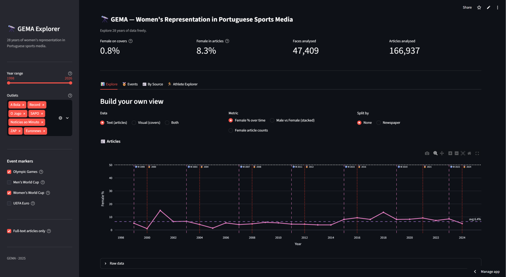

# GEMA

A longitudinal study of women's representation in Portuguese sports media (1996-2024), combining NLP protagonist detection and computer vision analysis of front-page covers.

## Quick Start

The processed results are already included in this repository; no need to re-run the pipeline.

**Explore the dashboard (no setup required):**

The interactive dashboard is publicly available at:
**https://gema-dashboard-npu4gb6tgvsmmkw23bsvqz.streamlit.app/**

**Run the dashboard locally:**

```bash
git clone https://github.com/nrguimaraes/gema-gender-evolution-in-multimodal-archives.git
cd gema-gender-evolution-in-multimodal-archives/demo
pip install -r requirements.txt
streamlit run app.py
```

**Use the data directly:**

```python
import json

# NLP results: women's representation in articles, one outlet/year
with open("data/processed/processed_wikineural_final/abolapt_2020.json", encoding="utf-8") as f:
    classified = json.load(f)  # list of articles, each with "gender_analysis" verdict

# CV results: face detection and gender classification on cover images
with open("data/processed/image_analysis/gender_vision_results_retinaface.json", encoding="utf-8") as f:
    vision = json.load(f)  # keyed by filename, e.g. vision["a-bola_2022-02-18.jpg"]
```

See [Loading the Data](#loading-the-data) below for more examples.

## Live Demo

The interactive dashboard is publicly available at:

**https://gema-dashboard-npu4gb6tgvsmmkw23bsvqz.streamlit.app/**

## Repository Structure

```
gema-gender-evolution-in-multimodal-archives/
  pipeline/       crawlers, NLP classifiers, CV pipeline, evaluation
  demo/           Streamlit dashboard (live demo above, Docker support included)
  data/
    annotations/  manual face-level annotations (90 covers, 383 faces)
    capas/
      images/     11,331 cover images (JPG), named <outlet>_<YYYY-MM-DD>.jpg
      metadata/   one JSON per cover with crawl metadata (source, date, original URL)
    raw/
      articles/   raw article JSON files, one per outlet per year
      links/      article URL lists from the link crawler
    cleaned/      cleaned article JSON files
    enriched/     articles with publication date added (input to NLP classifier)
    processed/
      image_analysis/             final CV pipeline results (RetinaFace + YOLOv8n)
      processed_wikineural_final/ final NLP results (WikiNeural 80/20 ensemble)
```

## Data

- **Text corpus**: 198,771 sports articles from 7 outlets, retrieved via [Arquivo.pt](https://arquivo.pt), spanning 1998-2024
- **Cover corpus**: 11,331 front-page cover images from 3 national sports newspapers (A Bola, Record, O Jogo), sourced from [VerCapas.com](https://www.vercapas.com), available in `data/capas/images/`

See [`data/README.md`](data/README.md) for full details, including the CSV-to-image naming convention.

## Pipeline

The pipeline has two main components:

- **NLP**: protagonist detection using a WikiNeural 80/20 weighted ensemble + Stanza morphological tagger, with Wikidata entity linking to identify female protagonists
- **CV**: face detection (RetinaFace) + gender classification (DeepFace) on cover images

See [`pipeline/README.md`](pipeline/README.md) for full details.

## Demo

The Streamlit dashboard allows exploration of 28 years of women's representation trends. See [`demo/README.md`](demo/README.md) to run locally or with Docker.



## Annotations

Manual annotations used for pipeline evaluation are in `data/annotations/`:

| File | Description |
|------|-------------|
| `Manual_Annotation_bbox.csv` | Face-level annotations for 90 covers (383 faces) |
| `gema_accuracy_audit_90_covers.csv` | Accuracy audit results for the CV pipeline |

The `Filename` column in both files maps each row directly to its cover image in `data/capas/images/`.

## Loading the Data

```python
import json, csv

# Load raw articles for one outlet/year
with open("data/raw/articles/abolapt_2020.json", encoding="utf-8") as f:
    articles = json.load(f)  # list of {"link", "source", "year", "title", "body_text"}

# Load NLP classification results for the same outlet/year
with open("data/processed/processed_wikineural_final/abolapt_2020.json", encoding="utf-8") as f:
    classified = json.load(f)  # same fields + "publication_date", "gender_analysis"

# Load CV pipeline results for all covers
with open("data/processed/image_analysis/gender_vision_results_retinaface.json", encoding="utf-8") as f:
    vision = json.load(f)  # keyed by filename, e.g. vision["a-bola_2022-02-18.jpg"]

# Load cover annotations (Filename column links to data/capas/images/)
with open("data/annotations/Manual_Annotation_bbox.csv", encoding="utf-8") as f:
    annotations = list(csv.DictReader(f))
```
